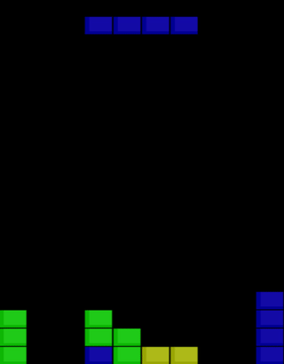

# Tetris Agents
Evolutionary and Q-Learning Tetris agents for the CSCI 5512: Artificial Intelligence 2 class project.



### Libraries Used
OpenAI Gym: https://github.com/openai/gym  
gym-tetris (OpenAI Gym environment): https://github.com/lusob/gym-tetris

### Setup Guide
```
sudo pip3 install gym
git clone https://github.umn.edu/sakhe003/tetrominoGoodPlacer.git
cd gym-tetris
sudo pip3 install -e .
```

### Running Agents
#### Q-learning
To run the q-learning single action agent run the following command from the qLearner directory:
```
python3 qlearning_single.py resume 113k_raw.pth.tar
```
To run the q-learning grouped action agent run the following command from the qLearner directory:
```
python3 convNet.py 162k_grouped.pth.tar
```

#### Evolutionary Agents
To train and run either of the evolutionary agents, run either of the following commands from the evolutionaryAgent directory:
- `python3 evolutionarySimulator.py` for the Decision Tree based Agent
- `python3 evolutionarySimulatorNN.py` for the Neural Network based Agent

### Search Agent
To train and run the evolutionary search agent, run the following command from the searchAgent directory:
```
python3 geneticSearchAgentSimulator.py
```

#### Random
To run the random agent run the following command in the randomAgent directory
```

python3 randomSimulator.py
```
By default it will give the stats for 100 simulations of a random agent. Number of simulations can be changed by passing an additional command line argument.


#### Human Controlled
To play the keyboard controlled version of the game use the following command in the humanControll directory:

```

python3 keyboardControl.py
```
The value you achieved for the metrics will be displayed on screen concluding the game.
